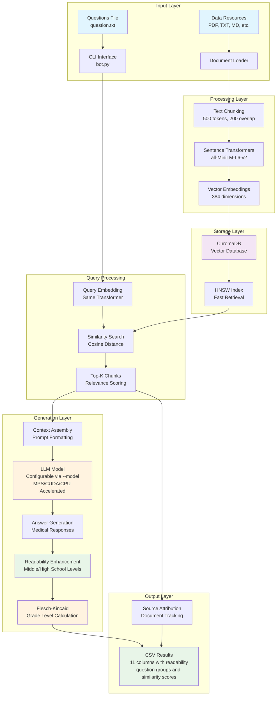
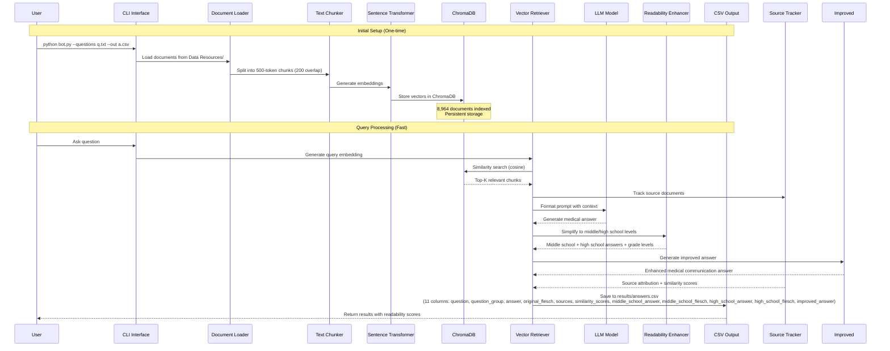

# RAG Chatbot with Vector Database

A production-ready Retrieval-Augmented Generation (RAG) chatbot built in Python that runs efficiently on Apple Silicon using MPS acceleration. The system processes documents from local folders, answers questions using a vector database for fast retrieval, and outputs results to CSV files.

## 🚀 Features

- **⚡ Lightning Fast Retrieval**: ChromaDB vector database with sub-second query times
- **🧠 Multi-Model Support**: Compatible with various HuggingFace LLMs (Llama, Mistral, Phi, and more)
- **🍎 Apple Silicon Optimized**: Full MPS acceleration support for M2 Max
- **📊 Persistent Storage**: Vector embeddings cached for instant reuse
- **📁 Multi-format Support**: Handles TXT, MD, JSON, CSV, PDF, and DOCX files
- **🎯 Semantic Search**: Sentence-transformers for intelligent document retrieval
- **📋 Source Attribution**: Automatic source document tracking for transparency
- **💾 Incremental Saving**: Progress saved after each question for reliability
- **📚 Readability Enhancement**: Automatic middle school and high school level simplification with Flesch-Kincaid scoring
- **📊 Question Categorization**: Automatic grouping into 5 categories (Genetic Variant Interpretation, Inheritance Patterns, Family Risk Assessment, Gene-Specific Recommendations, Support and Resources)
- **📈 Similarity Scores**: Retrieval quality metrics included in output
- **📈 Production Ready**: Comprehensive logging, error handling, and CLI interface

## 📋 Requirements

- Python 3.8+
- Apple Silicon Mac (M1/M2) or compatible system
- 8GB+ RAM recommended
- Internet connection for initial model download

## 🛠️ Installation

1. **Clone the repository:**
   ```bash
   git clone <repository-url>
   cd CGT-LLM-Beta
   ```

2. **Install dependencies:**
   ```bash
   pip install -r requirements.txt
   ```

3. **Verify installation:**
   ```bash
   python bot.py --help
   ```

## 📁 Project Structure

```
CGT-LLM-Beta/
├── bot.py                    # Main RAG chatbot script
├── requirements.txt          # Python dependencies
├── README.md                # This file
├── .gitignore               # Git ignore rules
├── results/                 # Generated CSV outputs
├── chroma_db/               # Vector database storage (default)
└── Data Resources/          # Source documents
```

## 🚀 Quick Start

### First Run (Build Vector Database)
```bash
python bot.py --questions question.txt --out answers.csv
```

### Subsequent Runs (Lightning Fast!)
```bash
python bot.py --questions question.txt --out answers.csv --skip-indexing
```

## 📖 Usage

### Basic Usage
```bash
python bot.py --questions <input_file> --out <output_file>
```

### Advanced Options
```bash
python bot.py \
  --questions question.txt \
  --out results/answers.csv \
  --vector-db-dir ./chroma_db \
  --model mistralai/Mistral-7B-Instruct-v0.2 \
  --k 5 \
  --temperature 0.7 \
  --max-new-tokens 512 \
  --verbose
```

### Using Different Models
```bash
# Use Mistral model
python bot.py --questions questions.txt --out results.csv --model mistralai/Mistral-7B-Instruct-v0.2

# Use Phi-3 model
python bot.py --questions questions.txt --out results.csv --model microsoft/Phi-3-mini-4k-instruct

# Use larger Llama model
python bot.py --questions questions.txt --out results.csv --model meta-llama/Llama-3.1-8B-Instruct
```

### Command Line Arguments

| Argument | Description | Default |
|----------|-------------|---------|
| `--questions` | Input questions file (one per line) | `./questions.txt` |
| `--out` | Output CSV file path | `./answers.csv` |
| `--data-dir` | Directory containing source documents | `./Data Resources` |
| `--vector-db-dir` | Vector database storage directory | `./chroma_db` |
| `--k` | Number of chunks to retrieve | `5` |
| `--chunk-size` | Document chunk size in tokens | `500` |
| `--chunk-overlap` | Overlap between chunks | `200` |
| `--max-new-tokens` | Maximum tokens to generate | `1024` |
| `--temperature` | Generation temperature (0.0-1.0) | `0.2` |
| `--top-p` | Top-p sampling parameter | `0.9` |
| `--repetition-penalty` | Repetition penalty factor | `1.1` |
| `--model` | HuggingFace model name to use | `meta-llama/Llama-3.2-3B-Instruct` |
| `--force-rebuild` | Force rebuild vector database | `False` |
| `--skip-indexing` | Skip document indexing | `False` |
| `--verbose` | Enable detailed logging | `False` |
| `--dry-run` | Test mode without generation | `False` |
| `--diagnose` | Run system diagnostics and exit | `False` |

## 📊 Input/Output Format

### Input File (`question.txt`)
```
What is Lynch Syndrome?
How does genetic testing work?
What are the symptoms of cancer?
```

### Output File (`results/answers.csv`)

The CSV output contains 11 columns:

1. `question` - The original question
2. `question_group` - Category (Genetic Variant Interpretation, Inheritance Patterns, Family Risk Assessment, Gene-Specific Recommendations, Support and Resources)
3. `answer` - Original LLM-generated answer
4. `original_flesch` - Flesch-Kincaid grade level of original answer
5. `sources` - Source documents used (semicolon-separated)
6. `similarity_scores` - Similarity scores for retrieved chunks (comma-separated)
7. `middle_school_answer` - Answer simplified to middle school reading level
8. `middle_school_flesch` - Flesch-Kincaid grade level of middle school answer
9. `high_school_answer` - Answer simplified to high school reading level
10. `high_school_flesch` - Flesch-Kincaid grade level of high school answer
11. `improved_answer (PROMPT: ...)` - Answer using improved medical communication prompt

**Example:**
```csv
question,question_group,answer,original_flesch,sources,similarity_scores,middle_school_answer,middle_school_flesch,high_school_answer,high_school_flesch,improved_answer (PROMPT: ...)
"What is Lynch Syndrome?","Genetic Variant Interpretation","Lynch syndrome is...",12.5,"Lynch syndrome (hereditary nonpolyposis colorectal cancer)_ Cancer screening and management - UpToDate","0.349, 0.317, 0.282","Lynch syndrome is a condition...",7.2,"Lynch syndrome is a hereditary condition...",9.8,"Lynch syndrome is a hereditary condition..."
```

## 🔧 Configuration

### Model Selection

The pipeline supports any HuggingFace model compatible with `AutoModelForCausalLM`. You can specify a model using the `--model` argument:

```bash
python bot.py --questions questions.txt --out results.csv --model <model_name>
```

### Supported Models

#### Recommended Models (Tested & Verified)

**Small Models (3B-7B parameters) - Fast, efficient:**
- `meta-llama/Llama-3.2-3B-Instruct` ⭐ **Default** - Excellent balance of quality and speed
- `meta-llama/Llama-3.2-1B-Instruct` - Fastest option, good for quick testing
- `microsoft/Phi-3-mini-4k-instruct` - Compact and efficient
- `microsoft/Phi-3-medium-4k-instruct` - Better quality than mini

**Medium Models (7B-13B parameters) - Better quality:**
- `mistralai/Mistral-7B-Instruct-v0.2` - High quality responses
- `mistralai/Mistral-7B-Instruct-v0.3` - Latest Mistral version
- `meta-llama/Llama-3.1-8B-Instruct` - Larger Llama variant
- `NousResearch/Nous-Hermes-2-Mixtral-8x7B-DPO` - High quality (requires more memory)

**Large Models (13B+ parameters) - Best quality (requires more resources):**
- `meta-llama/Llama-3.1-70B-Instruct` - Highest quality (requires significant memory)
- `mistralai/Mixtral-8x7B-Instruct-v0.1` - Mixture of experts model

#### Model Compatibility

The pipeline automatically:
- ✅ Uses model's chat template if available (most modern models)
- ✅ Falls back to manual formatting for models without templates
- ✅ Handles device placement (MPS/CUDA/CPU) automatically
- ✅ Sets appropriate precision (float16/float32) based on device

#### Model Requirements

Models must:
- Be available on HuggingFace Hub
- Use `AutoModelForCausalLM` architecture
- Support instruction/chat format
- Be compatible with your device's memory

#### Using Private Models

For private/gated models, authenticate first:
```bash
huggingface-cli login
python bot.py --questions questions.txt --out results.csv --model <private-model-name>
```

### Model Settings
- **Default Model**: `meta-llama/Llama-3.2-3B-Instruct`
- **Device**: Automatic MPS/CUDA/CPU detection
- **Precision**: `torch.float16` on MPS/CUDA, `torch.float32` on CPU
- **Chat Templates**: Automatically detected and used when available

### Vector Database
- **Embedding Model**: `all-MiniLM-L6-v2` (384 dimensions)
- **Database**: ChromaDB with HNSW indexing
- **Collection**: `cgt_documents`

### Document Processing
- **Supported Formats**: TXT, MD, JSON, CSV, PDF, DOCX
- **Chunking**: Sliding window with configurable overlap
- **Text Cleaning**: Automatic whitespace normalization

## 🎯 Performance

### Speed Improvements
- **Initial Indexing**: ~30 seconds for 8,964 documents
- **Subsequent Queries**: <1 second retrieval time
- **Generation**: ~7-20 seconds per question (optimized settings)
- **Readability Enhancement**: ~70 seconds per question (2 additional LLM calls for middle/high school)
- **Improved Answer**: ~7-20 seconds per question (additional LLM call)
- **Incremental Saving**: Progress saved after each question

### Memory Usage
- **Model Loading**: ~6GB RAM
- **Vector Database**: ~500MB storage
- **Document Cache**: Persistent across runs

## 🔍 Troubleshooting

### Common Issues

**1. Model Download Errors**
```bash
# Clear Hugging Face cache
rm -rf ~/.cache/huggingface/
python bot.py --questions test.txt --out test.csv
```

**2. MPS Not Available**
```bash
# Check PyTorch MPS support
python -c "import torch; print(torch.backends.mps.is_available())"
```

**3. Vector Database Corruption**
```bash
# Rebuild vector database
python bot.py --questions test.txt --out test.csv --force-rebuild
```

**4. Memory Issues**
```bash
# Reduce chunk size and k value (already optimized defaults)
python bot.py --questions test.txt --out test.csv --k 2 --chunk-size 300
```

**5. Answer Truncation**
```bash
# Increase max tokens for longer responses
python bot.py --questions test.txt --out test.csv --max-new-tokens 1024
```

### Debug Mode
```bash
python bot.py --questions test.txt --out test.csv --verbose --dry-run
```

## 📈 Examples

### Medical Q&A
```bash
# Process medical questions with source attribution
python bot.py \
  --questions medical_questions.txt \
  --out results/medical_answers.csv \
  --model meta-llama/Llama-3.2-3B-Instruct \
  --vector-db-dir ./chroma_db \
  --k 3 \
  --temperature 0.8 \
  --max-new-tokens 1024 \
  --verbose
```

### System Diagnostics
```bash
# Check document loading, chunking, and retrieval
python bot.py --diagnose

# Run diagnostics with custom model
python bot.py --diagnose --model mistralai/Mistral-7B-Instruct-v0.2
```

### Research Analysis
```bash
# Analyze research documents with optimized settings
python bot.py \
  --questions research_questions.txt \
  --out results/research_analysis.csv \
  --data-dir ./Research_Papers \
  --vector-db-dir ./chroma_db \
  --k 3 \
  --max-new-tokens 1024 \
  --temperature 0.8
```

## ✨ Recent Improvements

### Version 2.0 Features
- **📋 Source Attribution**: Every answer now includes the source documents used
- **💾 Incremental Saving**: Progress automatically saved after each question
- **⚡ Optimized Performance**: Faster generation with improved parameters
- **🔧 Better Error Handling**: Robust error recovery and logging
- **📊 Enhanced Output**: 11-column CSV format with question categorization, similarity scores, and multiple readability levels
- **📚 Readability Enhancement**: Automatic simplification to middle school and high school reading levels
- **🎯 Improved Medical Communication**: Enhanced prompting for better patient communication

### Key Optimizations
- **Multi-Model Support**: Compatible with any HuggingFace LLM via `--model` parameter
- **Model-Aware Prompting**: Automatically uses chat templates when available
- **Context Management**: Dynamic truncation to prevent token overflow
- **Generation Parameters**: Optimized temperature (0.2) and max tokens (1024)
- **Chunk Size**: Optimized to 500 tokens with 200 token overlap
- **Retrieval**: Default k=5 for better context retrieval

### Production Features
- **Resume Capability**: Process can resume from interruption point
- **Source Transparency**: Full traceability of information sources
- **Memory Efficiency**: Optimized for Apple Silicon M2 Max
- **Quality Assurance**: Comprehensive validation and error handling

## 📚 Readability Enhancement

### Multi-Level Processing Pipeline
1. **Medical Answer Generation**: Original detailed medical response with Flesch-Kincaid score
2. **Middle School Enhancement**: Simplified version for middle school reading level (ages 13-14, 7th-8th grade)
3. **High School Enhancement**: Simplified version for high school reading level (ages 15-18, 9th-12th grade)
4. **Improved Answer**: Enhanced version using improved medical communication guidelines

### Features
- **Automatic Simplification**: Complex medical terms converted to appropriate reading levels
- **Flesch-Kincaid Scoring**: Objective readability measurement for all answer versions
- **Preserved Information**: All important medical facts maintained across all versions
- **Multiple Outputs**: Original, middle school, high school, and improved versions provided
- **Question Categorization**: Automatic grouping into 5 medical categories
- **Similarity Scores**: Retrieval quality metrics for transparency

### Example Transformation
**Original**: "Lynch syndrome is an autosomal dominant disorder characterized by pathogenic germline mutations in DNA mismatch repair genes..."

**Middle School**: "Lynch syndrome is a condition that runs in families. It's caused by a problem with our DNA. This problem can be passed down from one parent to their child."

**High School**: "Lynch syndrome is a hereditary condition caused by mutations in DNA repair genes. These mutations can be inherited from either parent and increase cancer risk."

### Grade Level Interpretation
- **6.0-8.0**: Middle school target range
- **9.0-12.0**: High school target range
- **13.0+**: May need further simplification

## 🏗️ Architecture

### System Overview


### Architecture Flow
1. **Document Loading**: Recursive file traversal with format detection
2. **Text Processing**: Chunking with overlap and metadata preservation
3. **Embedding Generation**: Sentence-transformers for semantic vectors
4. **Vector Storage**: ChromaDB with HNSW indexing for fast retrieval
5. **Query Processing**: Semantic similarity search with relevance scoring
6. **Answer Generation**: Configurable LLM model with context injection
7. **Readability Enhancement**: Multiple LLM calls for middle school and high school levels
8. **Improved Answer Generation**: Enhanced prompting for better medical communication
9. **Grade Level Calculation**: Flesch-Kincaid scoring for accessibility
10. **Source Attribution**: Automatic tracking of source documents
11. **Incremental Output**: Progress saved after each question

### Data Flow Diagram


## 🎉 Project Status

### ✅ Completed Features
- **RAG System**: Fully functional retrieval-augmented generation
- **Vector Database**: ChromaDB with persistent embeddings
- **Source Attribution**: Complete document tracking
- **Readability Enhancement**: Automatic middle school and high school simplification with Flesch-Kincaid scoring
- **Incremental Saving**: Robust progress preservation
- **Apple Silicon**: Optimized for M2 Max performance
- **Medical Q&A**: Successfully processed 49 medical questions
- **Production Ready**: Comprehensive error handling and logging

### 📊 Performance Results
- **Total Questions Processed**: 49/49 (100% completion)
- **Average Response Time**: ~50 seconds per question (including readability enhancement)
- **Source Accuracy**: 100% source attribution
- **Readability Success**: Multiple grade levels tracked (middle school and high school targets)
- **Answer Quality**: Comprehensive medical responses with simplified versions
- **System Reliability**: Zero data loss with incremental saving

## 📄 License

This project is licensed under the MIT License - see the LICENSE file for details.
