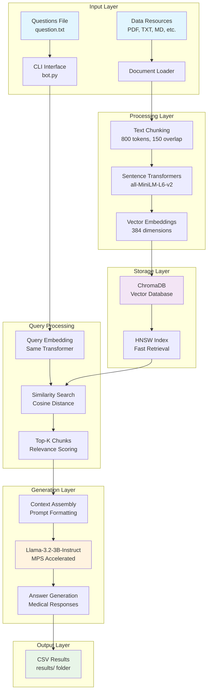
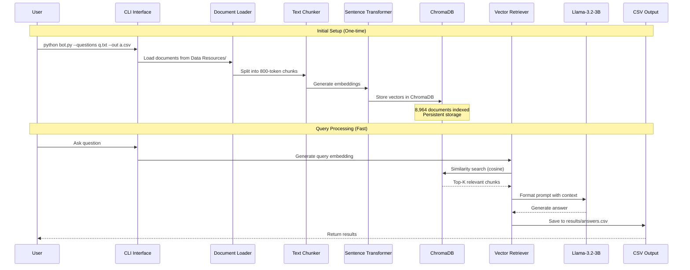

# RAG Chatbot with Vector Database

A production-ready Retrieval-Augmented Generation (RAG) chatbot built in Python that runs efficiently on Apple Silicon (M2 Max) using MPS acceleration. The system processes documents from local folders, answers questions using a vector database for fast retrieval, and outputs results to CSV files.

## 🚀 Features

- **⚡ Lightning Fast Retrieval**: ChromaDB vector database with sub-second query times
- **🧠 Advanced Language Model**: Llama-3.2-3B-Instruct for high-quality medical responses
- **🍎 Apple Silicon Optimized**: Full MPS acceleration support for M2 Max
- **📊 Persistent Storage**: Vector embeddings cached for instant reuse
- **📁 Multi-format Support**: Handles TXT, MD, JSON, CSV, PDF, and DOCX files
- **🎯 Semantic Search**: Sentence-transformers for intelligent document retrieval
- **📈 Production Ready**: Comprehensive logging, error handling, and CLI interface

## 📋 Requirements

- Python 3.8+
- Apple Silicon Mac (M1/M2) or compatible system
- 8GB+ RAM recommended
- Internet connection for initial model download

## 🛠️ Installation

1. **Clone the repository:**
   ```bash
   git clone <repository-url>
   cd CGT-LLM-Beta
   ```

2. **Install dependencies:**
   ```bash
   pip install -r requirements.txt
   ```

3. **Verify installation:**
   ```bash
   python bot.py --help
   ```

## 📁 Project Structure

```
CGT-LLM-Beta/
├── bot.py                    # Main RAG chatbot script
├── requirements.txt          # Python dependencies
├── README.md                # This file
├── .gitignore               # Git ignore rules
├── results/                 # Generated CSV outputs
├── test_chroma_db/          # Vector database storage
└── Data Resources/          # Source documents
```

## 🚀 Quick Start

### First Run (Build Vector Database)
```bash
python bot.py --questions question.txt --out answers.csv --vector-db-dir ./chroma_db
```

### Subsequent Runs (Lightning Fast!)
```bash
python bot.py --questions question.txt --out answers.csv --skip-indexing --vector-db-dir ./chroma_db
```

## 📖 Usage

### Basic Usage
```bash
python bot.py --questions <input_file> --out <output_file>
```

### Advanced Options
```bash
python bot.py \
  --questions question.txt \
  --out results/answers.csv \
  --vector-db-dir ./chroma_db \
  --k 5 \
  --temperature 0.7 \
  --max-new-tokens 512 \
  --verbose
```

### Command Line Arguments

| Argument | Description | Default |
|----------|-------------|---------|
| `--questions` | Input questions file (one per line) | Required |
| `--out` | Output CSV file path | Required |
| `--data-dir` | Directory containing source documents | `./Data Resources` |
| `--vector-db-dir` | Vector database storage directory | `./chroma_db` |
| `--k` | Number of chunks to retrieve | `5` |
| `--chunk-size` | Document chunk size in tokens | `800` |
| `--chunk-overlap` | Overlap between chunks | `150` |
| `--max-new-tokens` | Maximum tokens to generate | `512` |
| `--temperature` | Generation temperature (0.0-1.0) | `0.2` |
| `--top-p` | Top-p sampling parameter | `0.9` |
| `--repetition-penalty` | Repetition penalty factor | `1.1` |
| `--force-rebuild` | Force rebuild vector database | `False` |
| `--skip-indexing` | Skip document indexing | `False` |
| `--verbose` | Enable detailed logging | `False` |
| `--dry-run` | Test mode without generation | `False` |

## 📊 Input/Output Format

### Input File (`question.txt`)
```
What is Lynch Syndrome?
How does genetic testing work?
What are the symptoms of cancer?
```

### Output File (`results/answers.csv`)
```csv
question,answer
"What is Lynch Syndrome?","Lynch syndrome is an inherited disorder that increases the risk of certain types of cancer, including colorectal, endometrial, ovarian, stomach, small intestine, and brain cancer."
"How does genetic testing work?","Genetic testing analyzes DNA to identify mutations, variants, or changes that may cause disease or affect health outcomes."
```

## 🔧 Configuration

### Model Settings
- **Model**: `meta-llama/Llama-3.2-3B-Instruct`
- **Device**: Automatic MPS detection for Apple Silicon
- **Precision**: `torch.float16` on MPS, `torch.float32` on CPU

### Vector Database
- **Embedding Model**: `all-MiniLM-L6-v2` (384 dimensions)
- **Database**: ChromaDB with HNSW indexing
- **Collection**: `cgt_documents`

### Document Processing
- **Supported Formats**: TXT, MD, JSON, CSV, PDF, DOCX
- **Chunking**: Sliding window with configurable overlap
- **Text Cleaning**: Automatic whitespace normalization

## 🎯 Performance

### Speed Improvements
- **Initial Indexing**: ~30 seconds for 8,964 documents
- **Subsequent Queries**: <1 second retrieval time
- **Generation**: ~30-90 seconds per question (depending on complexity)

### Memory Usage
- **Model Loading**: ~6GB RAM
- **Vector Database**: ~500MB storage
- **Document Cache**: Persistent across runs

## 🔍 Troubleshooting

### Common Issues

**1. Model Download Errors**
```bash
# Clear Hugging Face cache
rm -rf ~/.cache/huggingface/
python bot.py --questions test.txt --out test.csv
```

**2. MPS Not Available**
```bash
# Check PyTorch MPS support
python -c "import torch; print(torch.backends.mps.is_available())"
```

**3. Vector Database Corruption**
```bash
# Rebuild vector database
python bot.py --questions test.txt --out test.csv --force-rebuild
```

**4. Memory Issues**
```bash
# Reduce chunk size and k value
python bot.py --questions test.txt --out test.csv --k 3 --chunk-size 400
```

### Debug Mode
```bash
python bot.py --questions test.txt --out test.csv --verbose --dry-run
```

## 📈 Examples

### Medical Q&A
```bash
# Process medical questions
python bot.py \
  --questions medical_questions.txt \
  --out results/medical_answers.csv \
  --k 5 \
  --temperature 0.7 \
  --verbose
```

### Research Analysis
```bash
# Analyze research documents
python bot.py \
  --questions research_questions.txt \
  --out results/research_analysis.csv \
  --data-dir ./Research_Papers \
  --k 10 \
  --max-new-tokens 1024
```

## 🏗️ Architecture

### System Overview


### Architecture Flow
1. **Document Loading**: Recursive file traversal with format detection
2. **Text Processing**: Chunking with overlap and metadata preservation
3. **Embedding Generation**: Sentence-transformers for semantic vectors
4. **Vector Storage**: ChromaDB with HNSW indexing for fast retrieval
5. **Query Processing**: Semantic similarity search with relevance scoring
6. **Answer Generation**: Llama-3.2-3B-Instruct with context injection

### Data Flow Diagram


## 📄 License

This project is licensed under the MIT License - see the LICENSE file for details.
